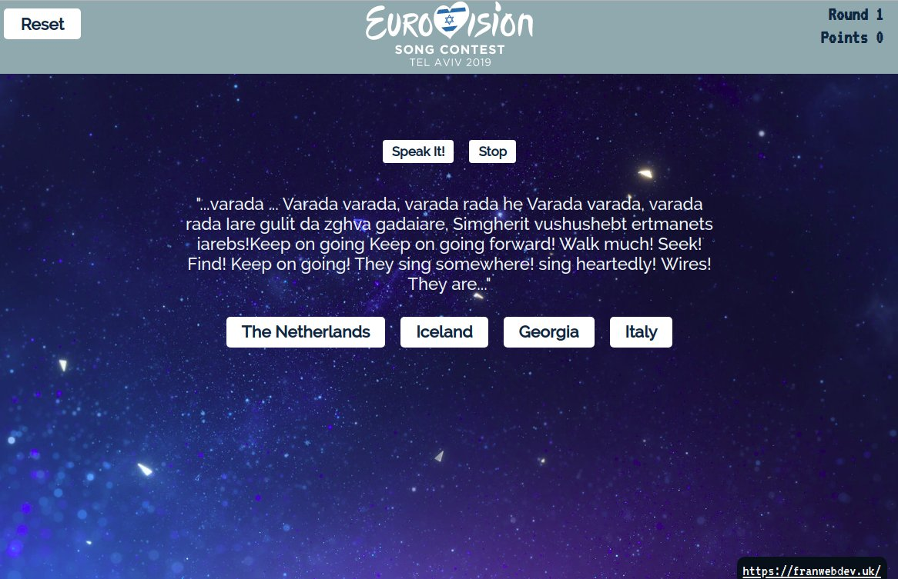

 

In 2018 i made a Eurovision lyrics quiz app with React.js. I threw it together with some particularly hack-y use of Cheerio and Request.js to fetch the data and i pieced together the game in React.js. As you can see below the design was super basic.

 

As Eurovision 2019 rolled onto the horizon i thought i would make an updated version. Plus it's good to see, even in a relatively throwaway project such as this, how very far my coding has developed. I set a rule of not spending a long time on it. And yet i was able to create a vastly superior design. 

  

This time around I included use of the Speech Synthesis API available in modern browsers to speak the lyrics back to the player.

  

The web scraping took minutes rather than the hours it did last year. Every element of the code was improved with a full rewrite. It's a goofy project but i really like Eurovision and it's a nice excuse to have some creative coding fun.

  