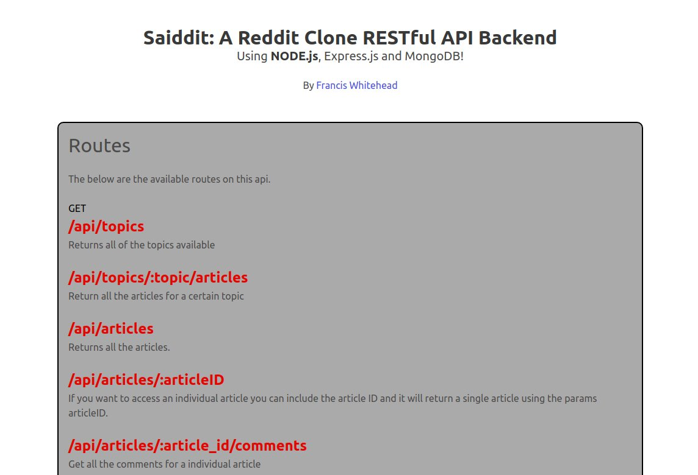
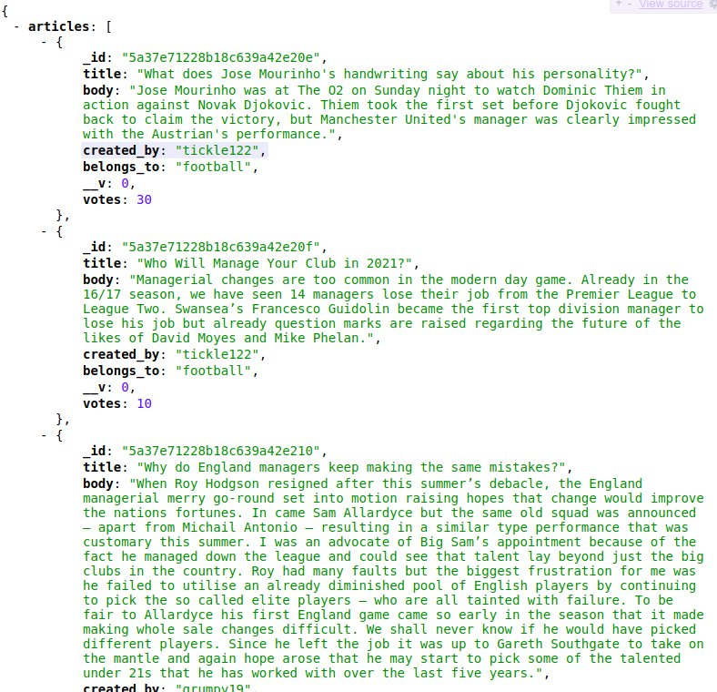
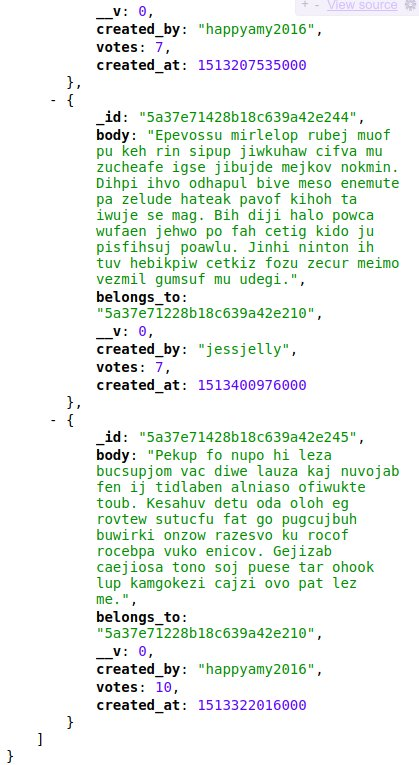

  

A RESTful back-end with all the end-points necessary to feed whatever framework (or none) one may choose for the front-end. With endpoints for articles, articles filtered by subject, comments, voting on articles, voting on comments and user profiles.

  

I used Node.js with Express.js and MongoDB. This is part of a larger full-stack project wherein I used React.js for the front-end.

  

All the endpoints are fully tested using Mocha and Chai. The database is hosted on mLab.com. The project is currently hosted on Heroku.
