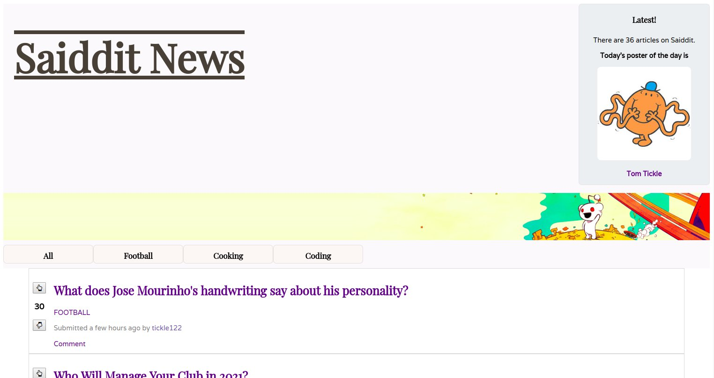
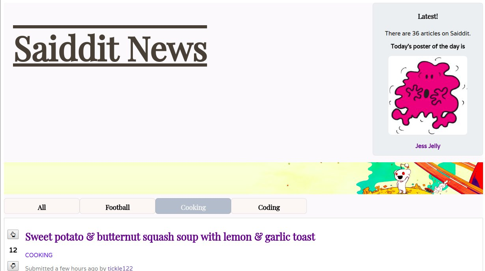
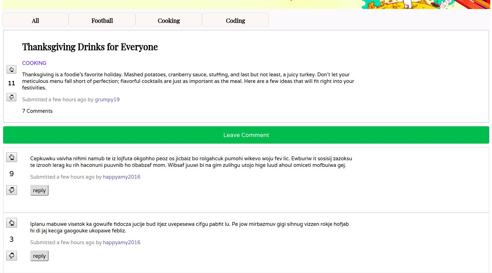
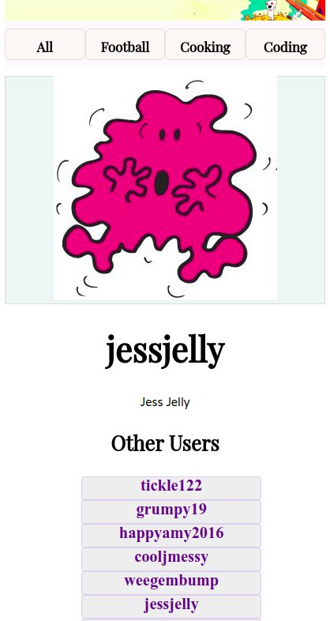

  

The aim was to create a Reddit style single-page-app using React.js. In the app you would be able to read articles, sort them by subject matter, vote on the articles, post comments under an article, vote on those comments and view a user profile page.  

I used React.js and React Router for the routing. You can filter by subject using the topic buttons. I did not use any style frameworks preferring instead to write the CSS myself. I used Proptype checking to make sure I had complete control of the data I was passing around my app.  

  

I used the fonts ‘Varela’ and ‘Playfair Display’, both from Google Fonts. ‘Varela’ is an elegant sans-serif design, great for extended reading without being boring or ugly, while ‘Playfair Display’, for headings and titles, is a little bit more ornate. 

  
 
The page has a responsive design allowing for comfortable viewing on mobile, tablet or desktop.  

  