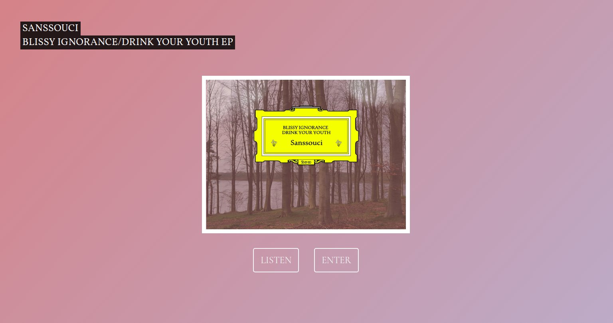
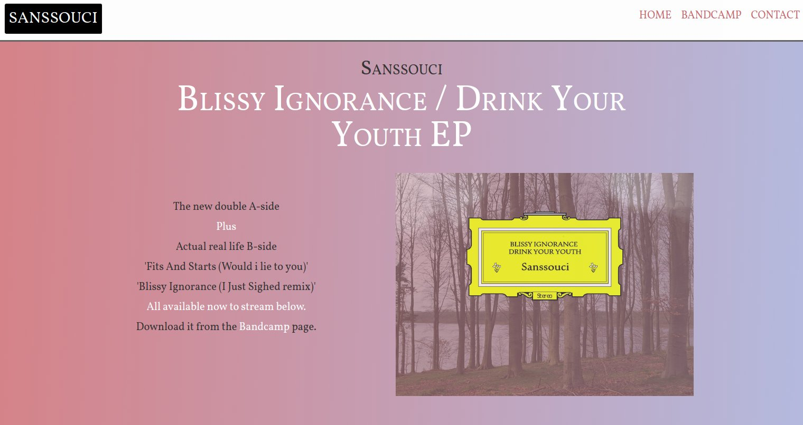
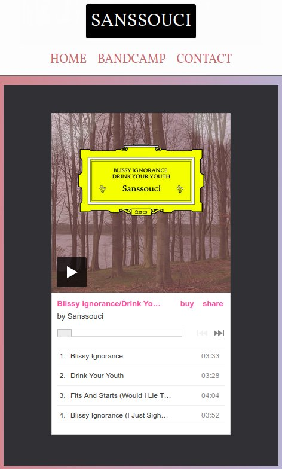
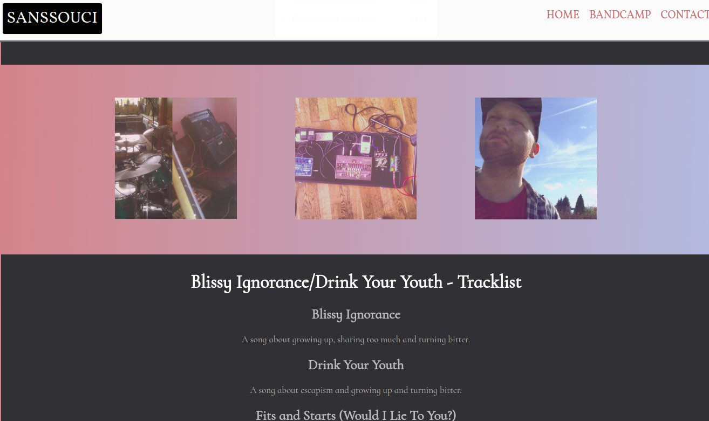

  

I wanted to create a beautiful website for the band Sanssouci. The website was to go live to coincide with the release of their first double a-side single in May 2017. It would show the artwork, it would include a music player (using an iframe from Bandcamp.com where the single would be on sale) and would give some information about the release. 

The majority of the page is HTML and CSS. Initially jQuery was used to give the smooth scrolling affects when navigation links are clicked and the Bootstrap framework for responsive layouts. In April 2018 I revisted the project to update things with best practice, a few minor tweaks to the design and to improve performance.

 

I removed all the Bootstrap classes from the HTML markup and started writing CSS almost from scratch. Things look better on all screen sizes. I removed jQuery in order to reduce the page load time and instead added some custom JS to provide the smooth navigational scrolling.

  

In order to speed up performance I had to remove a background colour effect where the colour would ease from pink slowly into a purple hue and then back again. The effect was subtle and looked great but the huge animation made the page run very slowly, particularly on mobile phones.

  

Finally I used Gulp to minimise the CSS and JS respectively so that the website can serve an optimised page.  