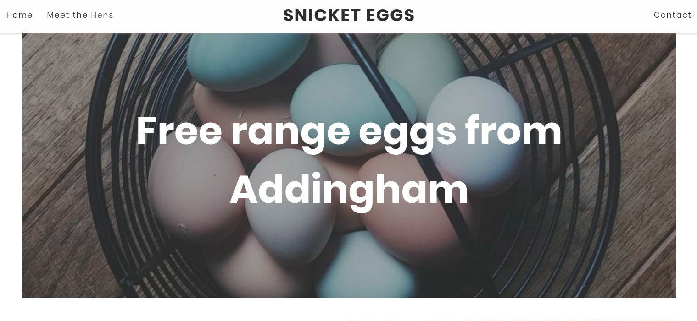
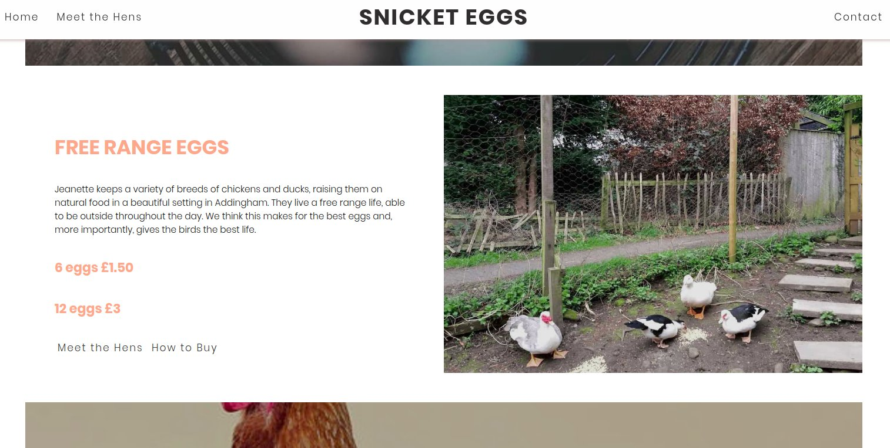
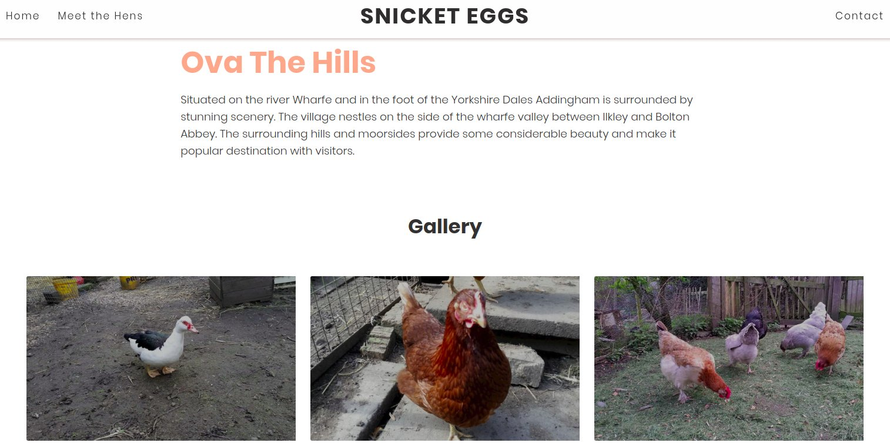
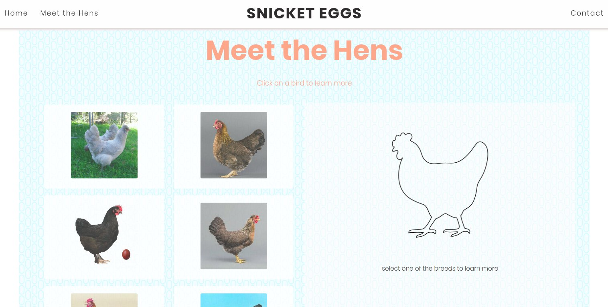
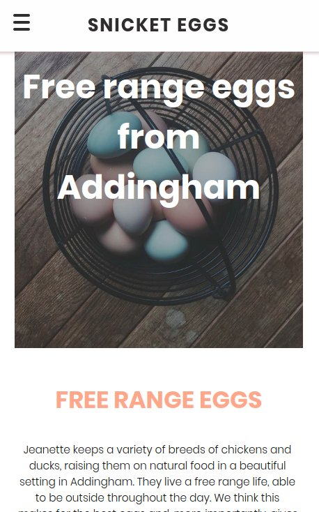
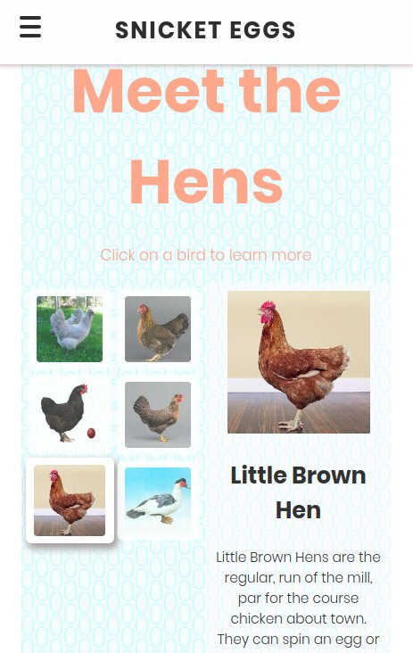

  

It is important to first explain i am not dangerously infatuated with eggs. However, i am lucky that my mother keeps chickens for eggs. So when she asked me to create a website to help her sell more of her eggs how could i not?

  

__DESIGN__

In terms of design i went for a modern, somewhat minimalist style with a simple colour pallete of black, white, a light blue that echoes the blue eggs of the Araucana breed and a peach colour which, again, echoes an egg shell colour but more vibrant.

  

__ANIMATIONS__

The site uses a animations for fade in and slide in effects, and transitions when leaving a page. This requires some minor link hijacking but the fallback is standard link behaviour so that the website can be accessible. 

 

__VUE.JS__

The 'Meet the Hens' page uses Vue.js to create an interactive introduction to the various breeds kept, complete with animations.

__OPTIMISATION__

In order to speed up performances images are lazy loaded with the user seeing a blurry image initially. I managed to achieve a good lighthouse score whilst still using large hi-res images.

 

__MOBILE__

The mobile design benefits from the various image optimisations. 

 
